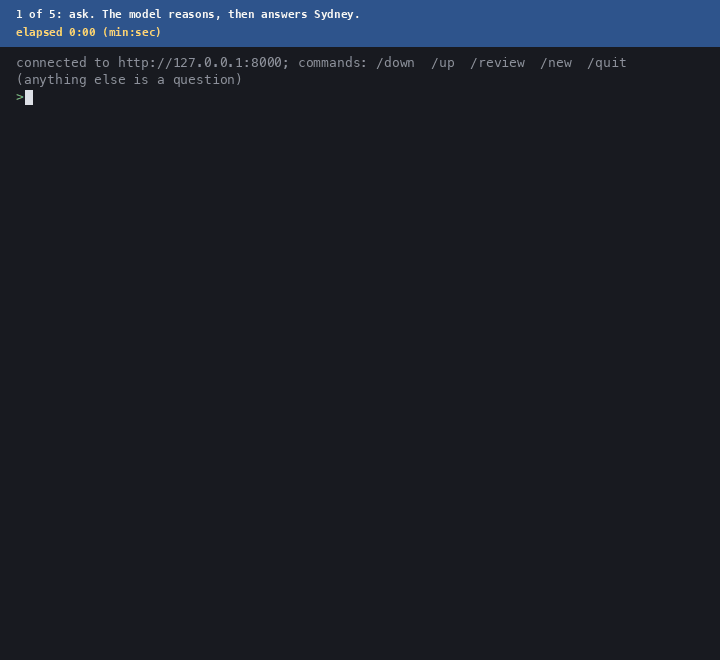

# Adaptible

[self-link to github repo](https://github.com/ible-ai/adaptible)

A small language model that keeps its conversations and retrains itself on its
own corrections, on a laptop.

Deployed language models are frozen: they answer, forget the exchange, and
answer the same way tomorrow. Adaptible wraps a 1.5B reasoning model
(`DeepSeek-R1-Distill-Qwen-1.5B`) in a server that records every turn,
revisits its past answers when idle, rewrites the ones it now thinks are wrong,
and fine-tunes LoRA adapters on the rewrites. It runs on Apple Silicon through
MLX; the self-repair loop also runs on a CUDA GPU through PyTorch.

The model is small on purpose. A frontier model given a correction would absorb
it, and that would show nothing about the mechanism. A 1.5B distilled reasoner
gets basic facts wrong, loops inside its own chain of thought, and has weights
entangled enough that one update moves unrelated facts. Every failure mode of
self-training is visible at this scale, so any lift that appears is
informative.

## How it works

The server answers prompts and stores every turn, user and assistant, in
memory and in SQLite. Nothing is discarded, so a mistake made at noon can be
examined at midnight.

On request or on a schedule, the model is shown its past exchanges and asked
to pick a response it could improve and rewrite it. The rewrite must address
the right turn, be a plausible length, and not be degenerate; otherwise it is
discarded rather than trained on. Each accepted rewrite becomes one training
example, the original prompt followed by the new answer, with a loss mask that
is zero over the prompt and one over the rewrite. Only LoRA adapters on the
last few layers receive gradients, so an update is small, cheap, and
reversible.

A model this size produces training targets that are wrong, or right for the
wrong reasons, more often than not, and a bad update can erase facts the model
already had. The self-repair loop therefore never trusts a target. It samples
candidates from the model's own reasoning, trains a few steps, regenerates the
answers to the original question and to paraphrases of it, and keeps the new
weights only if those answers improved. Otherwise the weights are restored
from a copy and the next candidate is tried. An update survives by changing
what the model says, not by lowering a loss.

Reasoning models this size also loop: they repeat a sentence, or circle inside
their chain of thought and never answer. Generation carries two loop breakers,
and a generation that never reaches an answer is judged wrong, so the loop
cannot be satisfied by a model that has stopped answering.

## Conclusion

On five facts the model gets wrong, each tested on the original question and
three untrained phrasings, four of five runs reach at least 16 correct answers
out of 20 within sixteen cycles. The fifth peaks at 13 before degrading into
looping. What happens after the lift varies: the score can hold or drift.
Run as a served node with nothing
but a thumbs-down and a document store to consult, the same loop repairs
three of the five facts by the second session and the patches survive a
restart; over sixteen sessions later repairs then start to undo earlier ones,
because the node checks its own control prompts but not its earlier repairs.
The write-up, with the data behind each number, is in
[`results/`](results/README.md).

## Demo

The terminal client shows the loop end to end, with the server running in
another window:

1. Ask a question the model gets wrong. `What is the capital of Australia?`
   It reasons for a paragraph and answers Sydney.
2. Type `/down`.
3. Type `/review`. The node looks the question up in its document store, reads
   the passage, writes a corrected answer, trains on it in the background, and
   keeps the update only if its own re-asks agree; the client reports when it
   is done.
4. Type `/new` and ask again in other words: `Which city is Australia's capital?`



<details>
<summary>Show the model's reasoning as it streams</summary>


Both recordings are the same run with identical frame timing; the one above
hides the reasoning behind a "thinking ..." line.

</details>

The recording above is one run of exactly that sequence on a freshly
started server, sped up where marked, with the elapsed real time shown
throughout; the only cut is the ten-minute review wait, marked on the clock.
[`media/demo.mp4`](media/demo.mp4) and [`media/demo-thinking.mp4`](media/demo-thinking.mp4)
are the two recordings as video. Step 4 comes out right when
step 3 kept an update; the write-up in [`results/`](results/README.md) has
the numbers across five facts and sixteen sessions.

## Run it

Python 3.13+. Apple Silicon for the server and evaluation harness; any CUDA
GPU for the self-repair loop through `scripts/colab/`.

```bash
git clone https://github.com/ible-ai/adaptible && cd adaptible
python -m venv .venv && .venv/bin/pip install -e .
.venv/bin/python -m adaptible.local                      # server at http://127.0.0.1:8000
.venv/bin/python -m adaptible.local.cli                        # in another terminal: ask, /down, /review, /new
PYTHONPATH=. .venv/bin/python scripts/cycles_mlx.py      # the self-repair loop
.venv/bin/python -m adaptible.eval --subset 20 --shuffle --no_browser   # baseline / train / re-measure
```

To wrap an existing Ollama model without downloading another checkpoint:

```bash
python -m pip install -e '.[wrap]'
adaptible wrap ollama qwen3:0.6b
```

The wrapper connects Ollama, llama.cpp, LM Studio, and vLLM using existing local
weights. Flagging a short factual answer triggers automatic web evidence lookup,
training, and checks before an update is kept; no correction file is required.
Learned questions use the latest cumulative adapter; other requests use the
original model. Matching respects thinking mode and conversation context and
may decline unfamiliar paraphrases. This does not establish global weight stability.
Dense Qwen2/Qwen2.5 and Qwen3 text architectures are implemented. Qwen3.8's
hybrid architecture is not supported yet, and adapters belong to their exact
base checkpoint.

Qwen3 0.6B passed two accumulating automatic repairs, retention, restart, and
streaming in all four native runtimes with thinking disabled. Thinking-enabled
learning is implemented, but no native thinking-learning run has passed yet.
The wrapper's terminal client now enables thinking by default. These short
integration runs do not establish stability over the original multi-hour workload.
Run with `--flagship-recipe`, all four runtimes reproduce the original's
generations, training and trained adapter token for token in
`scripts/wrapper_parity.py`, which anyone can rerun. vLLM on Apple Silicon
computes with MLX, and Ollama's f16 KV cache can still diverge on other
prompts.
The [wrapper README](adaptible/wrap/README.md) has setup commands, client
integration, model and memory limits, and the current verification table.

`scripts/colab/adaptible_cycles.ipynb` runs the loop on a free Colab T4 and
resumes across sessions. Module READMEs under `adaptible/` document
endpoints, flags, and metrics. These fast model-free checks test code behavior;
they do not replace native learning runs:

```bash
python -m unittest adaptible.classes_test adaptible.local.api_test \
    adaptible.local.local_test adaptible.paths_test adaptible.eval.eval_test \
    adaptible.autonomous.autonomous_test adaptible.local.cli_test adaptible.revise_test
```

## Layout

```text
adaptible/                    shared: llm.py (StatefulLLM), revise.py (conversation ->
                              training example), classes, db, lookup, paths
adaptible/local/              FastAPI server and terminal client (cli.py)
adaptible/eval/               dataset, evaluation harness, meta-learning, reports
adaptible/autonomous/         learning from web search against the model's beliefs
adaptible/wrap/               `adaptible wrap`: repair a model served by Ollama, llama.cpp, LM Studio, vLLM
scripts/cycles_mlx.py         self-repair loop (MLX)
scripts/colab/                the same loop in PyTorch, Colab notebook
scripts/cycles_results.py     run log -> tables and plot
results/                      write-up and data
```

Tests sit beside the code they cover as `<name>_test.py`.

## License

Contact for information.
