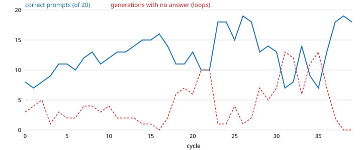

# Does it work? Experiments and data

The question this repository exists to ask: can a small language model on a
laptop repair its own factual errors, using its own reasoning as the training
signal, without falling apart?

## Why a small local model

The model is `DeepSeek-R1-Distill-Qwen-1.5B`, bf16, on a 16 GB M3 laptop at
27 tokens per second. It is underpowered for this on purpose. A frontier model
could absorb a correction and generalise it, which would tell us little. A 1.5B
distilled reasoner gets basic capitals wrong, loops in its own chain of thought,
and has parameters so entangled that one update moves dozens of unrelated
facts. If anything resembling self-teaching shows up here, it shows up under
the worst conditions, and the failure modes are visible instead of hidden
behind capacity.

The bar is therefore not "did it become smart". It is: over repeated cycles of
self-repair, does accuracy on held-out phrasings go up, does the model stay
coherent, and where does it break.

## The experiment

Five facts the model gets wrong at baseline (capitals of Morocco, Turkey,
Australia, the Philippines; the nearest star), each tested on its original
question plus three hand-written paraphrases: 20 prompts.

Each cycle:

1. Score all 20 prompts with greedy decode and a substring judge.
2. For every item still under 4/4, sample up to two candidate training targets
   from the model's own reasoning: temperature 0.7, the question plus a
   one-line reference note giving the answer, kept as a candidate only if the
   think block closed and the first answer sentence names the answer.
3. Train at most 4 LoRA steps on the candidate (its own think block, then its
   own answer sentence), stopping when the answer-token loss drops below 0.15.
4. Generate the item's 4 prompts again. Keep the update if the score rose,
   otherwise restore the weights from a copy and verify a checksum.

No rehearsal, no cross-item guard, no learning-rate tuning. The full
configuration is in each run folder.

## Result: MLX run, 2026-09-11

Data: [`self-repair-cycles-2026-09-11-mlx/`](self-repair-cycles-2026-09-11-mlx/)
(per-cycle table with per-item marks, per-candidate table with loss and
keep/restore, configuration).



| Cycle | 0 | 5 | 10 | 16 | 21 | 26 | 31 |
|---|---|---|---|---|---|---|---|
| Correct prompts, of 20 | 8 | 11 | 12 | **16** | 10 | **19** | 7 |
| Generations with no answer | 3 | 2 | 4 | 0 | 10 | 1 | 13 |

Baseline before any training: 4 of 20.

1. **Lift.** From 4 to 16 over 16 cycles with the loop count falling to zero,
   then to 19 at cycle 26. Four of the five facts reached 4/4 and held for
   multiple cycles. The filter does the work: 53 of 209 candidates were kept,
   and most rejected candidates made their own item worse.
2. **Drift, with a mechanism.** From about cycle 17 the model's samples
   converge on the phrasing of the prompt they are sampled from ("The correct
   answer is..."), the answer-token loss on its own samples reaches zero, and
   kept updates become tie-break noise. Scores then swing between 7 and 19
   with loops rising.
3. **No nosedive.** Through 31 cycles the model never collapsed to the
   bare-word or empty-think regimes that whole-target fine-tuning produced in
   earlier experiments. It stays a reasoning model that answers most prompts.
4. **One fact never took.** Turkey trains to zero loss under its own sample's
   reasoning and still says Istanbul when it thinks freely.

Caveats: five items, one model, greedy decode with a noise floor of about two
points, a substring judge, and the candidates were sampled with the correct
answer in the prompt. The facts came from outside; the reasoning that carried
them into the weights is the model's own.

A second run of the same loop in PyTorch on a Colab T4 is in progress and will
be added here.

## Earlier measurements

These motivated the loop above and are not evidence for it.

- Fine-tuning directly on dataset labels (rank-32 LoRA, 25 steps per item)
  taught 53 to 59 percent of trained facts, with no movement on held-out
  items.
- The server's own critique-and-rewrite prompt was followed by the 1.5B model
  in 1 of 84 cases; the one update that resulted changed the model's answer
  style on every question.
- A three-seed meta-learning run over 80 items was inside binomial noise.
- Whole-target fine-tuning on a corrected answer, with or without the model's
  own rationale in the target, fixed the trained item and disturbed most
  others; token-level edits of the wrong trace were local but did not change
  what the model generated.

## Reproduce

Mac, MLX, about 25 minutes per cycle:

```bash
CYCLES=40 PYTHONPATH=. .venv/bin/python scripts/cycles_mlx.py | tee cycles.log
.venv/bin/python scripts/cycles_results.py --log cycles.log --out results/my-run
```

Colab, free T4, resumes across sessions: open
[`scripts/colab/adaptible_cycles.ipynb`](../scripts/colab/adaptible_cycles.ipynb)
and Run all. Details in [`scripts/colab/README.md`](../scripts/colab/README.md).
